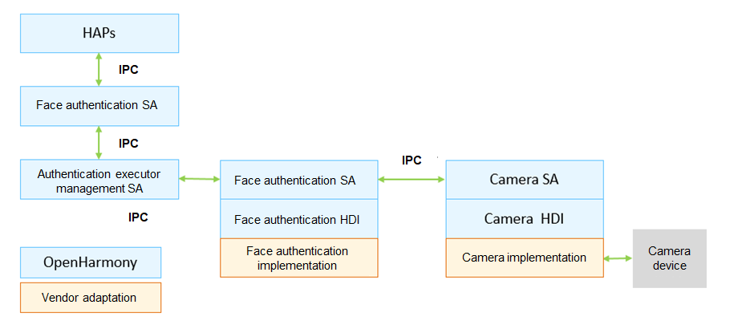

# Face Authentication


## Introduction

Face authentication (faceauth) supports recording, deletion, and authentication of user faces.

faceauth is a biometric authentication executor supported by OpenHarmony. It registers face authentication resource information with the collaborative authentication framework based on the resource registration interface defined by collaborative authentication, and invokes camera functions according to the scheduling of the collaborative authentication framework to record, delete, and authenticate user faces.

**Figure 1** Face authentication architecture



Facial data is important biometric information of users. The following security measures are taken to protect the facial data during the authentication process:

- Permission management: High access permissions are defined for face recording and deletion APIs, which can be invoked only by setter applications.
- Secure storage and comparison of facial data: The faceauth HDI defines the adaptation interfaces for device vendors. Device vendors can implement secure facial data comparison and storage in a trusted execution environment (TEE). <sup>Note 1</sup>

Note 1: The OpenHarmony open-source framework provides stub implementation of face authentication for developers to demo the face authentication function. The stub software implementation does not include secure storage and comparison of facial data in a TEE.

## Directory Structure

```
//base/useriam/face_auth
├── bundle.json              # Module description file
├── figures                  # Figures used in the README
├── sa_profile               # Service ability profile 
├── services                 # Service implementation
└── ui                       # User interface for face recording
```

## Usage

* To adapt to the face authentication function, device vendors must implement the interface defined in the IDL file **//drivers/interface/faceauth** file, **//drivers/peripheral/faceauth** provides interface the stub implementation for development reference.
* The extraction, comparison, storage, and recording of facial data must be implemented in a secure environment (TEE/secure chipset) to ensure the highest security level in the system.

## Repositories Involved

[useriam_user_auth_framework](https://gitee.com/openharmony/useriam_user_auth_framework)

[useriam_pin_auth](https://gitee.com/openharmony/useriam_pin_auth)

**[useriam_face_auth](https://gitee.com/openharmony/useriam_face_auth)**

[drivers_interface](https://gitee.com/openharmony/drivers_interface)

[drivers_peripheral](https://gitee.com/openharmony/drivers_peripheral)
