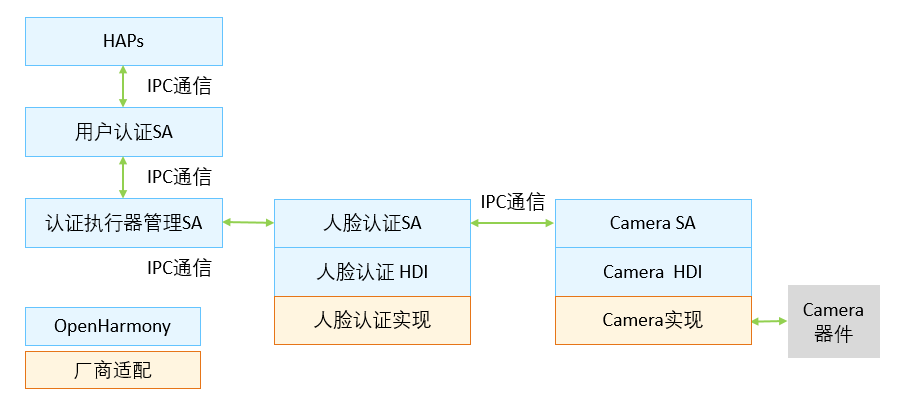

# 人脸认证组件

- [简介](#简介)
- [目录](#目录)
- [使用说明](#使用说明)
- [相关仓](#相关仓)

## 简介

**人脸认证** （faceauth）支持用户人脸的录入，删除和认证功能。

人脸认证是OpenHarmony支持的一种生物认证执行器，按照协同认证定义的资源注册接口，将人脸认证相关资源信息注册到协同认证框架，并根据协同认证框架的调度，调用相机功能，完成人脸的录入，删除和认证功能。

**图1** 人脸认证架构图



人脸数据是用户的重要生物识别信息，在人脸认证的处理过程中，我们对用户输入的人脸数据实施了如下安全保护措施：

1. 管理权限：人脸的录入和删除流程定义了较高的访问权限，仅允许设置应用调用。
1. 人脸数据安全存储和比对：人脸认证HDI中定义了南向厂商适配的接口，南向厂商可以自行在可信执行环境内完成人脸数据的安全存储和比对。<sup>注1</sup>

*注1：OpenHarmony开源框架内提供了人脸认证的桩实现，供开发者demo人脸认证功能，桩软件实现部分未包含可信执行环境内完成人脸数据的安全存储和比对。*

## 目录

```
//base/user_iam/face_auth
├── bundle.json              # 组件描述文件
├── figures                  # README使用的图片
├── sa_profile               # Service Ability 配置文件
├── services                 # Service Ability 服务实现
└── ui                       # 人脸录入界面
```

## 使用说明

* 南向厂商适配人脸认证功能时，需实现头文件`face_auth_ca.h` 中定义的接口。人脸数据的提取、比对、存储和录入等过程应在尽可能安全的环境中实现，保证用户人脸数据的的安全保护达到系统内可以提供的最高安全级别（可信执行环境/安全芯片）。

## 相关仓

[useriam_auth_executor_mgr](https://gitee.com/openharmony/useriam_auth_executor_mgr)

[useriam_user_idm](https://gitee.com/openharmony/useriam_useridm)

[useriam_user_auth](https://gitee.com/openharmony/useriam_userauth)

[useriam_pin_auth](https://gitee.com/openharmony/useriam_pin_auth)

**[useriam_faceauth](https://gitee.com/openharmony/useriam_faceauth)**
